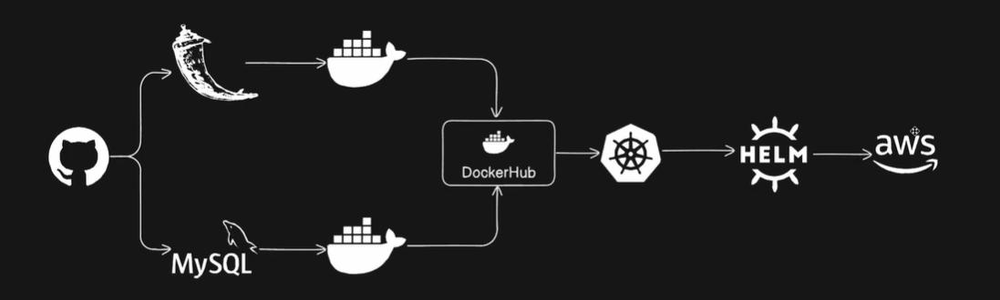

# 🚀 Two-Tier Flask Application Deployment

<p align="center">
  
  
  
  
  
  
  
  
  
</p>

<p align="center">
  <strong>Production-Ready Two-Tier Application Deployment using Docker, Kubernetes, Helm, and AWS-ready Infrastructure.</strong>
</p>

---

<p align="center">
  
</p>

---

# 📖 Overview

This project demonstrates a complete DevOps deployment workflow for a Flask and MySQL application, covering the journey from local development to Kubernetes orchestration and Helm-based deployments.

The project follows a modern cloud-native architecture and showcases containerization, orchestration, infrastructure automation, service management, and deployment best practices commonly used in production environments.

---

# ✨ Key Highlights

* Flask + MySQL Two-Tier Architecture
* Dockerized Application and Database
* Docker Compose for Local Development
* Kubernetes Deployments and Services
* Helm Chart Packaging and Deployment
* Kind-Based Local Kubernetes Cluster
* AWS EKS Ready Architecture
* CI/CD Ready with Jenkins
* InitContainer Based Dependency Management
* Real-World Kubernetes Troubleshooting
* Cloud-Native Deployment Practices

---

# 🏗️ Architecture

```text
Developer
    │
    ▼
GitHub Repository
    │
    ▼
Docker Build
    │
    ▼
DockerHub Registry
    │
    ▼
Kubernetes Cluster
    │
    ▼
Helm Deployment
    │
    ▼
AWS EKS Ready Infrastructure
```

### Application Architecture

```text
┌─────────────────────┐
│     Flask App       │
│   Python Backend    │
└──────────┬──────────┘
           │
           ▼
┌─────────────────────┐
│       MySQL         │
│     Database        │
└─────────────────────┘
```

---

# 🛠️ Technology Stack

| Layer              | Technology     |
| ------------------ | -------------- |
| Backend            | Flask (Python) |
| Database           | MySQL 5.7      |
| Containerization   | Docker         |
| Local Development  | Docker Compose |
| Orchestration      | Kubernetes     |
| Package Management | Helm           |
| Local Kubernetes   | Kind           |
| CI/CD              | Jenkins        |
| Cloud Platform     | AWS EKS        |
| Registry           | DockerHub      |

---

# 📂 Project Structure

```text
two-tier-flask-app/
│
├── app.py
├── requirements.txt
├── Dockerfile
├── Dockerfile-multistage
├── docker-compose.yml
├── message.sql
│
├── templates/
│   └── index.html
│
├── k8s/
│   ├── deployment.yml
│   ├── svc.yml
│   └── mysql.yml
│
├── mysql-chart/
│   └── Helm Chart for MySQL
│
├── flask-app-chart/
│   └── Helm Chart for Flask Application
│
├── kind-setup/
│   └── config.yml
│
├── Jenkinsfile
├── Makefile
└── README.md
```

---

# ⚙️ Environment Configuration

### Flask Application

```env
MYSQL_HOST=mysql
MYSQL_USER=admin
MYSQL_PASSWORD=admin
MYSQL_DB=myDb
```

---

# 🐳 Docker Deployment

### Build Image

```bash
docker build -t <dockerhub-username>/flask-app:latest .
```

### Push to DockerHub

```bash
docker login

docker push <dockerhub-username>/flask-app:latest
```

---

# 🧪 Local Testing

Start services:

```bash
docker compose up -d
```

Verify:

```bash
docker ps
```

Stop services:

```bash
docker compose down -v
```

---

# ☸️ Kubernetes Deployment

## Create Kind Cluster

```bash
kind create cluster \
--name tws-cluster \
--config kind-setup/config.yml
```

Verify:

```bash
kubectl get nodes
```

---

## Deploy MySQL

```bash
kubectl apply -f k8s/mysql.yml
```

## Deploy Flask Application

```bash
kubectl apply -f k8s/deployment.yml

kubectl apply -f k8s/svc.yml
```

Verify:

```bash
kubectl get pods

kubectl get svc
```

---

# 📦 Helm Deployment

## Deploy MySQL Chart

```bash
cd mysql-chart

helm lint .

helm install mysql-chart .
```

Verify:

```bash
kubectl get pods

kubectl get svc mysql-chart
```

---

## Deploy Flask Application Chart

```bash
cd flask-app-chart

helm lint .

helm install flask-app-chart .
```

Verify:

```bash
kubectl get pods

kubectl get svc flask-app-chart
```

---

# ⏳ Database Dependency Handling

The Flask application uses an InitContainer to wait until MySQL becomes available before starting.

```yaml
initContainers:
  - name: wait-for-mysql
    image: mysql:5.7
```

Benefits:

* Prevents CrashLoopBackOff
* Ensures proper startup order
* Improves deployment reliability

---

# 🌐 Access Application

### NodePort

```bash
kubectl get svc flask-app-chart
```

Example:

```text
http://<NODE-IP>:32230
```

### Port Forwarding

```bash
kubectl port-forward svc/flask-app-chart 8080:80
```

Access:

```text
http://localhost:8080
```

---

# ☁️ AWS Deployment Strategy

This project is designed to be migrated seamlessly to AWS.

Target Architecture:

```text
Amazon EKS
│
├── Flask Application Pods
├── MySQL Database
├── Load Balancer
├── Helm Releases
└── Container Images from DockerHub
```

Recommended AWS Infrastructure:

* EC2 (t2.medium or higher)
* Amazon EKS
* Elastic Load Balancer
* DockerHub Registry
* Route53 (Optional)

---

# 🧹 Cleanup

Remove Helm Releases:

```bash
helm uninstall flask-app-chart

helm uninstall mysql-chart
```

Delete Kind Cluster:

```bash
kind delete cluster --name tws-cluster
```

Cleanup Docker:

```bash
docker system prune -af
```

---

# 🎯 DevOps Concepts Demonstrated

* Docker Containerization
* Multi-Stage Docker Builds
* Kubernetes Deployments
* Kubernetes Services
* InitContainers
* Helm Packaging
* Helm Release Management
* Service Discovery
* Container Registry Integration
* CI/CD Pipeline Foundations
* Cloud-Native Deployment Patterns
* AWS EKS Readiness

---

# 👨‍💻 Author

**Priyanshu Singh**

Cloud & DevOps Engineer

GitHub:
https://github.com/PriyanshuSingh10114

---

# ⭐ Support

If you found this project helpful:

* Star ⭐ the repository
* Fork 🍴 the project
* Build your own Kubernetes deployment pipeline

---

### Repository About Section

Description:

Production-ready Two-Tier Flask & MySQL deployment using Docker, Kubernetes, Helm, Kind, Jenkins, and AWS EKS-ready architecture.

Topics:

docker kubernetes helm flask mysql devops aws eks jenkins docker-compose kind cloud-native cicd python
